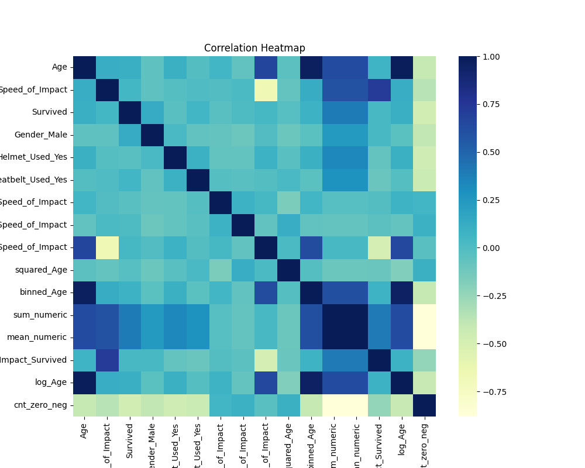
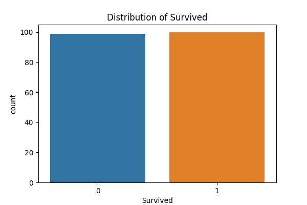
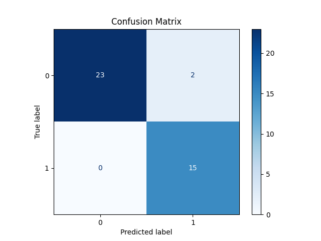

# 🚀 AutoML Pipeline Project

This repository showcases an **Automated Machine Learning (AutoML) Pipeline** for a **classification task** (predicting **"Survived"**). It is designed to demonstrate end-to-end data science workflow automation, advanced ML techniques, and proficiency with key tools and libraries.

## 🔥 Key Features

1. **🔄 Data Cleaning**  
   - Missing value imputation (median/mode)  
   - Categorical encoding (One-Hot Encoding)  
   - Feature scaling (StandardScaler)

2. **⚡ Feature Engineering**  
   - Custom feature transformations  
   - Automated feature synthesis using **Featuretools** (Deep Feature Synthesis)  

3. **📊 Rich Visualizations**  
   - Pre-training: Correlation heatmaps, target distribution, pairplots  
   - Post-training: Confusion matrix, classification report, ROC curve  
   - Visualizations are saved as `.png` files in the `visualizations/` directory

4. **🎯 Hyperparameter Tuning**  
   - **Optuna** for hyperparameter optimization  
   - Implements **K-Fold Cross-Validation** and **prunes** underperforming trials for efficiency

5. **🤖 Model Selection & Training**  
   - Multiple ML models (Logistic Regression, Random Forest, XGBoost, SVM, etc.)  
   - Selects the best model based on validation performance

6. **📋 Experiment Tracking with MLflow**  
   - Logs model parameters, metrics (Accuracy, F1-Score, ROC-AUC), and artifacts  
   - MLflow UI enables visualization and comparison of multiple experiment runs

---

## 💻 How To Run

1. **Install dependencies**:  
   ```bash
   pip install -r requirements.txt
   ```
   Or individually:
   ```bash
   pip install numpy pandas scikit-learn featuretools optuna mlflow seaborn matplotlib xgboost
   ```

2. **Place your raw data** in `data/raw/data.csv`  
   - Ensure the dataset contains a column `Survived`(or a final column that will be renamed to `Survived`). For your data just change name of your target with `Survived`.

3. **Run the main script**:  
   ```bash
   python main.py
   ```

4. **Explore the results**:
   - 📁 **Visualizations** in the `visualizations/` folder.
   - 📊 **MLflow Tracking**:
     ```bash
     mlflow ui --backend-store-uri sqlite:///mlflow.db
     ```
     Open [http://localhost:5000](http://localhost:5000) to view and compare experiment runs.

---

## 📈 Example Visualizations

### 🔥 Correlation Heatmap



### 🎯 Target Distribution



### 📊 Confusion Matrix (Post-Training)



---

## 🚀 Results

- **Validation Accuracy**: ~100%  
- **Test Accuracy**: ~90%  
- **F1-Score** and **ROC-AUC** metrics are also tracked in MLflow.

My data was pretty limited and seperable so high scores are expected. 

---


### 🛠️ Using MLflow in This Project:

- Every experiment run logs **model parameters**, **metrics** (Accuracy, F1-Score), and **artifacts**.
- All runs are stored in an **SQLite MLflow database** (`mlflow.db`).
- Start the MLflow UI:
  ```bash
  mlflow ui --backend-store-uri sqlite:///mlflow.db
  ```
  Explore experiments at [http://localhost:5000](http://localhost:5000).
  
